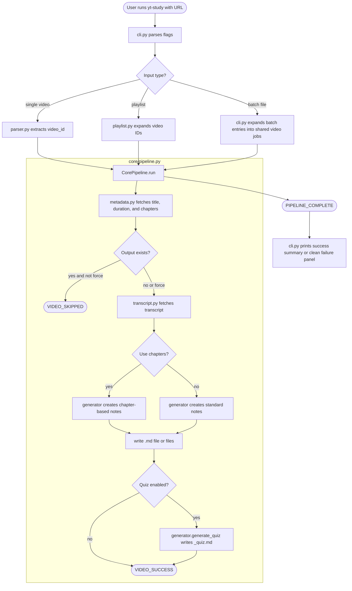
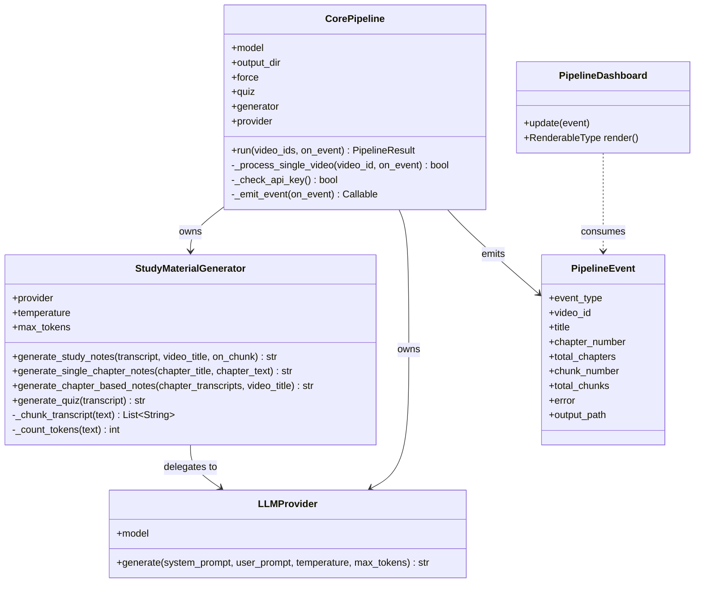
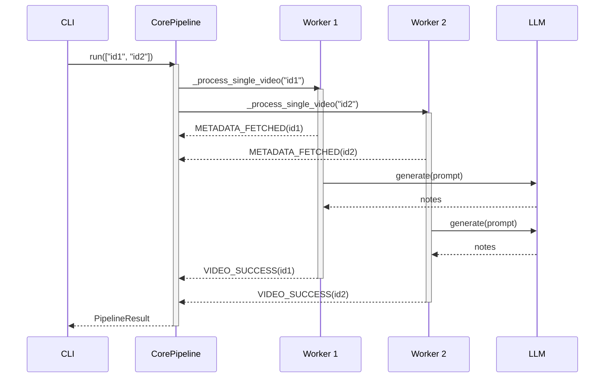

# Architecture

This document describes the internal structure of `yt-study` for contributors who want to understand how the pieces fit together.

## High-level overview

`yt-study` is a CLI application that accepts a YouTube URL (single video, playlist, or batch file), fetches transcript data from YouTube, and generates Markdown study notes (and optionally a quiz) through a large-language model.

The code is split into three main layers:

| Layer | Package           | Role                                                                     |
| ----- | ----------------- | ------------------------------------------------------------------------ |
| CLI   | `yt_study/cli.py` | Parses flags, owns Rich dashboard / headless printing, launches pipeline |
| Core  | `yt_study/core/`  | All business logic — YouTube retrieval, LLM generation, orchestration    |
| UI    | `yt_study/ui/`    | Rich live-dashboard rendering helpers                                    |

`core/` is UI-free by design; it never imports Rich or anything from `ui/`.

---

## Data-flow diagram



---

## Class relationships



---

## Async concurrency model

`CorePipeline.run()` processes multiple video IDs concurrently using `asyncio.gather`
guarded by a shared semaphore (`config.max_concurrent_videos`). Each video slot
corresponds to one worker in the Rich dashboard.

Concurrency depends on the entry shape:

- direct playlist processing passes playlist video IDs into one concurrent pipeline run
- batch-file processing expands playlist entries into per-video jobs inside one shared batch worker pool
- failed or private batch entries are collected and reported after the batch finishes instead of stopping remaining work



---

## Module map

```text
src/yt_study/
├── __init__.py             — package version
├── cli.py                  — Typer app, flag parsing, dashboard bridge
├── setup_wizard.py         — interactive config writer
├── core/
│   ├── config.py           — runtime Config dataclass, env loading
│   ├── pipeline.py         — CorePipeline, PipelineEvent, EventType, sanitize_filename
│   ├── llm/
│   │   ├── generator.py    — StudyMaterialGenerator (chunking + generation)
│   │   └── providers.py    — LiteLLM async wrapper (LLMProvider)
│   ├── prompts/
│   │   ├── study_notes.py  — standard note-generation prompts
│   │   ├── chapter_notes.py— chapter note-generation prompts
│   │   └── quiz.py         — multiple-choice quiz prompts
│   └── youtube/
│       ├── parser.py       — URL parsing (video, playlist, shorts, embed)
│       ├── metadata.py     — title, duration, chapters, playlist info
│       ├── transcript.py   — transcript fetch with language fallback & retry
│       └── playlist.py     — playlist ID → video ID expansion with retry
└── ui/
    └── dashboard.py        — Rich live-dashboard state and rendering
```

---

## Key design rules

1. **`core/` is UI-free.** No Rich imports inside `src/yt_study/core/`.
2. **Blocking I/O off the event loop.** Native YouTube extractor calls are wrapped in `asyncio.to_thread(...)`.
3. **Progress via events.** `CorePipeline` emits `PipelineEvent` objects through a callback; the CLI converts them into dashboard updates, headless progress lines, and final summaries.
4. **User-facing failures stay in the CLI.** The terminal shows simplified, non-technical failures while detailed tracebacks stay in the current session log.
5. **Config is a 3-part contract.** Adding a provider key requires updating `Config.ALLOWED_KEYS`, `Config.get_api_key_name_for_model()`, and `Config._sync_env_vars()`.
