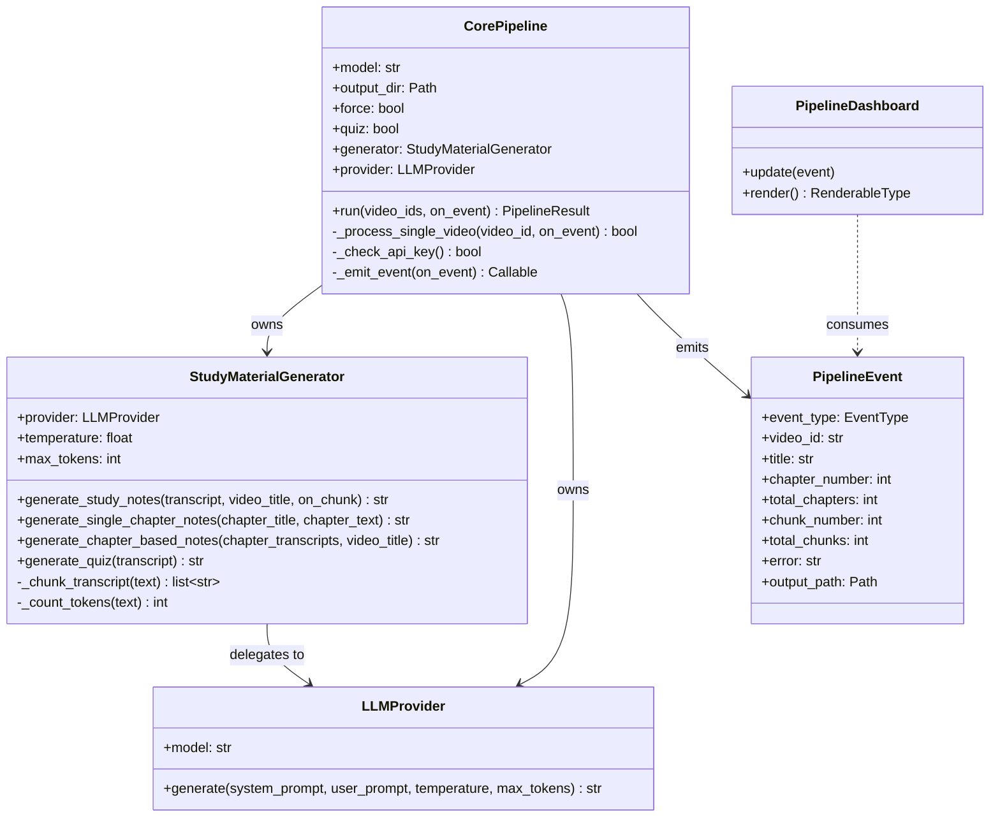
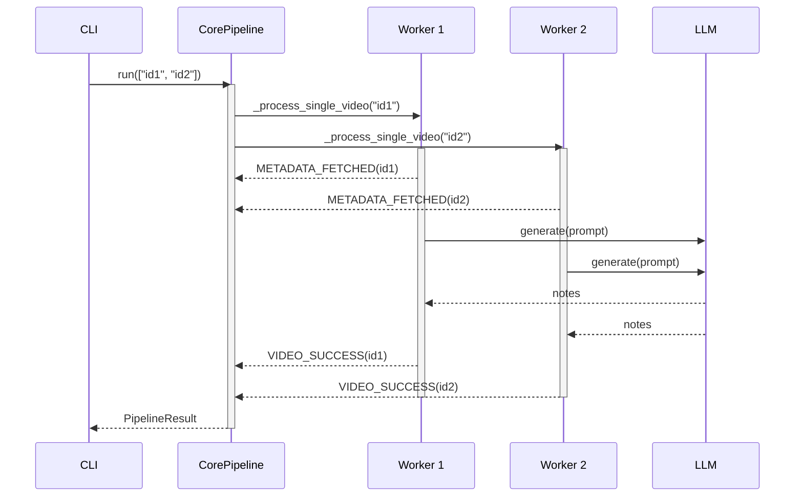

# Architecture

This document describes the internal structure of `yt-study` for contributors who want to understand how the pieces fit together.

## High-level overview

`yt-study` is a CLI application that accepts a YouTube URL (single video, playlist, or batch file), fetches transcript data from YouTube, and generates Markdown study notes (and optionally a quiz) through a large-language model.

The code is split into three main layers:

| Layer | Package | Role |
|---|---|---|
| CLI | `yt_study/cli.py` | Parses flags, owns Rich dashboard / headless printing, launches pipeline |
| Core | `yt_study/core/` | All business logic — YouTube retrieval, LLM generation, orchestration |
| UI | `yt_study/ui/` | Rich live-dashboard rendering helpers |

`core/` is UI-free by design; it never imports Rich or anything from `ui/`.

---

## Data-flow diagram

```mermaid
flowchart TD
    A([User: yt-study process URL]) --> B[cli.py: parse flags]
    B --> C{Input type}
    C -- single video --> D[parser.py: extract video_id]
    C -- playlist --> E[playlist.py: expand video IDs]
    C -- batch file --> F[cli.py: read line-by-line]
    D & E & F --> G[CorePipeline.run]

    subgraph Pipeline [core/pipeline.py]
        G --> H[metadata.py: title / duration / chapters]
        H --> I{Checkpoint: output exists?}
        I -- yes, no --force --> J([VIDEO_SKIPPED])
        I -- no or --force --> K[transcript.py: fetch transcript]
        K --> L{use chapters?}
        L -- yes --> M[generator: chapter-based notes]
        L -- no --> N[generator: standard notes]
        M & N --> O[write .md file/s]
        O --> P{--quiz?}
        P -- yes --> Q[generator.generate_quiz → write _quiz.md]
        P -- no --> R([VIDEO_SUCCESS])
        Q --> R
    end

    G --> S([PIPELINE_COMPLETE])
    S --> T[cli.py: print summary]
```

---

## Class relationships



---

## Async concurrency model

`CorePipeline.run()` processes multiple video IDs concurrently using `asyncio.gather` guarded by a shared semaphore (`config.max_concurrent_videos`).
Each video slot corresponds to one worker in the Rich dashboard.



---

## Module map

```text
src/yt_study/
├── __init__.py             — package version
├── cli.py                  — Typer app, flag parsing, dashboard bridge
├── setup_wizard.py         — interactive config writer
├── core/
│   ├── config.py           — runtime Config dataclass, env loading
│   ├── pipeline.py         — CorePipeline, PipelineEvent, EventType, sanitize_filename
│   ├── llm/
│   │   ├── generator.py    — StudyMaterialGenerator (chunking + generation)
│   │   └── providers.py    — LiteLLM async wrapper (LLMProvider)
│   ├── prompts/
│   │   ├── study_notes.py  — standard note-generation prompts
│   │   ├── chapter_notes.py— chapter note-generation prompts
│   │   └── quiz.py         — multiple-choice quiz prompts
│   └── youtube/
│       ├── parser.py       — URL parsing (video, playlist, shorts, embed)
│       ├── metadata.py     — title, duration, chapters, playlist info
│       ├── transcript.py   — transcript fetch with language fallback & retry
│       └── playlist.py     — playlist ID → video ID expansion with retry
└── ui/
    └── dashboard.py        — Rich live-dashboard state and rendering
```

---

## Key design rules

1. **`core/` is UI-free.** No Rich imports inside `src/yt_study/core/`.
2. **Blocking I/O off the event loop.** `pytubefix` and `youtube-transcript-api` calls are wrapped in `asyncio.to_thread(...)`.
3. **Progress via events.** `CorePipeline` emits `PipelineEvent` objects through a callback; the CLI converts them to either dashboard updates or plain console lines (`--no-ui`).
4. **Config is a 3-part contract.** Adding a provider key requires updating `Config.ALLOWED_KEYS`, `Config.get_api_key_name_for_model()`, and `Config._sync_env_vars()`.
