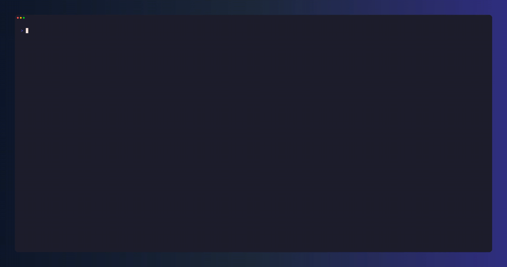

<div align="center">

# 🎓 NoteWise

**Convert YouTube videos and playlists into comprehensive AI-powered study notes — from your terminal.**

<br />

           

<br /><br />

[**Why NoteWise?**](#-why-notewise) · [**Quick Start**](#-quick-start) · [**Features**](#-features) · [**Installation**](#-installation) · [**Configuration**](#configuration) · [**Providers**](#-supported-providers) · [**Contributing**](CONTRIBUTING.md)
<br/>
[**Web Docs**](https://docs.notewise.click)

</div>

## 💡 Why NoteWise?

YouTube has become one of the richest learning platforms on the planet — university lectures, conference talks, technical deep-dives, language lessons, and entire courses are all freely available. But video is a passive medium. You watch, you nod, and two days later the details are gone.

**NoteWise was built to fix that gap.**

The idea is simple: your time watching a video is valuable. The notes that _should_ come from it — the structured, searchable, reviewable kind — shouldn't require an extra hour of your day. NoteWise automates exactly that step. Point it at any YouTube URL and walk away with Markdown study notes that are deeper and more comprehensive than most people would write by hand.

**Where it shines:**

- 📚 **Students** catching up on lecture recordings or supplementing textbooks with YouTube explanations
- 🧑‍💻 **Developers** staying on top of conference talks, tutorials, and technical deep-dives without watching at 3x speed
- 🌍 **Language learners** extracting structured notes from native-language content
- 📋 **Researchers** quickly distilling hours of talks into organized, searchable reference material
- 🏢 **Teams** turning internal video presentations into shareable written documentation

The output isn't a transcript summary. It's structured, hierarchical Markdown — with headers, sub-topics, definitions, examples, and every concept explained in depth. Videos with YouTube chapters get chapter-aware notes by default, and you can opt into per-chapter files with `--chapter-directory-output`. Everything lands in your filesystem: portable, searchable, and permanently yours.

## 🎬 Demo

<p align="center">
  
</p>

<p align="center">
  <sub>Watch the full demo: <a href="demo/notewise.mp4">demo/notewise.mp4</a></sub>
</p>

## ✨ Features

|                                        |                                                                                            |
| -------------------------------------- | ------------------------------------------------------------------------------------------ |
| 📹 **Single Video, Playlists & Batch** | Process one video, an entire playlist, or a `.txt` file of URLs in a single command        |
| 🤖 **Multi-Provider LLM Support**      | Works with Gemini, OpenAI, Anthropic, Groq, OpenRouter, Azure, Vercel AI Gateway, ChatGPT/Copilot OAuth, and other major LiteLLM providers |
| 🗂️ **Chapter-Aware Notes**             | Detects YouTube chapters, generates bundled chapter-aware notes, and can write per-chapter files with `--chapter-directory-output` |
| ❓ **Quiz Generation**                 | Optionally produce a ready-to-use multiple-choice quiz alongside each study guide          |
| 📄 **Multiple Output Formats**        | Write study notes as `.md`, `.html`, `.pdf`, or `.docx` with cleaner typography and layout |
| 📝 **Transcript Export**               | Export raw transcripts as plain `.txt` or timestamped `.json`                              |
| ⚡ **Concurrent Processing**           | Configurable concurrency — process multiple videos and chapters simultaneously             |
| 💾 **Local SQLite Cache**              | Transcripts and run stats are cached; skip already-processed videos automatically          |
| 🖥️ **Rich Live Dashboard**             | Real-time progress UI with a `--no-ui` plain-output mode for CI/cron                       |
| 🐳 **Docker Ready**                    | Minimal two-stage Docker image for reproducible, stateless runs                            |
| 🔒 **Private Video Support**           | Pass a Netscape-format cookie file to process age-gated or login-required videos           |

## 🚀 Quick Start

### 1 · Install

```bash
uv tool install notewise
```

Or with [pipx](https://pipx.pypa.io/stable/):

```bash
pipx install notewise
```

For standalone binaries with checksum verification and PATH setup:

```bash
curl -fsSL https://github.com/whoisjayd/notewise/releases/latest/download/install.sh | sh
```

### 2 · Configure

Run the interactive setup wizard once to pick your provider and store any required API key:

```bash
notewise setup
```

This creates `~/.notewise/config.env`. The default model is **Gemini 2.5 Flash** — grab a free key at [aistudio.google.com](https://aistudio.google.com/app/apikey).

Subscription-backed providers use OAuth instead of static API keys:

```bash
notewise auth login chatgpt
notewise auth login github_copilot
```

OAuth tokens are stored under `~/.notewise/oauth/` by default, not in `config.env`.

### 3 · Generate Study Notes

```bash
# Single video
notewise process "https://youtube.com/watch?v=VIDEO_ID"

# Render a PDF study guide
notewise process "https://youtube.com/watch?v=VIDEO_ID" --format pdf

# Write multiple outputs in one run
notewise process "https://youtube.com/watch?v=VIDEO_ID" --format md,html,pdf,docx

# Full playlist
notewise process "https://youtube.com/playlist?list=PLAYLIST_ID"

# Batch file (one URL per line)
notewise process my-course-urls.txt -o ./course-notes
```

Notes are written to `./output/` (or your configured directory) as Markdown by default. Pass `--format` with one value or a comma-separated list like `md,html,pdf` to generate additional rendered outputs.

## 📦 Installation

### Requirements

- Python **3.10** or newer (3.10, 3.11, 3.12, and 3.13 are tested in CI)
- An API key or OAuth access for at least one [supported LLM provider](#-supported-providers)

### uv (recommended)

```bash
uv tool install notewise
```

### pipx

```bash
pipx install notewise
```

### pip

```bash
pip install notewise
```

`uv tool install` and `pipx install` are the best choices when you want `notewise` available from anywhere on your system `PATH`. Plain `pip install` installs the CLI into the active Python environment.

### Standalone Binary Installer

```bash
curl -fsSL https://github.com/whoisjayd/notewise/releases/latest/download/install.sh | sh
```

On Windows:

```powershell
irm https://github.com/whoisjayd/notewise/releases/latest/download/install.ps1 | iex
```

Both installer scripts verify `SHA256SUMS.txt`, install the release binary, and update your user-level `PATH`.

### Docker

```bash
docker pull ghcr.io/whoisjayd/notewise:latest

docker run --rm \
  -e GEMINI_API_KEY="your_key" \
  -v "$(pwd)/output:/output" \
  ghcr.io/whoisjayd/notewise:latest \
  process "https://youtube.com/watch?v=VIDEO_ID"
```

### Development Install

```bash
git clone https://github.com/whoisjayd/notewise
cd notewise
uv sync --dev
```

### Updating

Check for a newer release and print the recommended upgrade command for your install:

```bash
notewise update
```

<a id="configuration"></a>

## ⚙️ Configuration

notewise reads configuration from `~/.notewise/config.env` (created by `notewise setup`).
Environment variables always take precedence over the config file.

### Key Settings

| Key                           | Default                   | Description                        |
| ----------------------------- | ------------------------- | ---------------------------------- |
| `DEFAULT_MODEL`               | `gemini/gemini-2.5-flash` | LiteLLM-format model string        |
| `OUTPUT_DIR`                  | `./output`                | Where study notes are saved        |
| `TEMPERATURE`                 | `0.7`                     | LLM sampling temperature (0.0–1.0) |
| `MAX_TOKENS`                  | _(model default)_         | Max tokens per LLM response        |
| `MAX_CONCURRENT_VIDEOS`       | `5`                       | Parallel video processing limit    |
| `YOUTUBE_REQUESTS_PER_MINUTE` | `10`                      | YouTube request rate limit         |
| `YOUTUBE_COOKIE_FILE`         | _(none)_                  | Path to Netscape cookies file      |
| `CHATGPT_TOKEN_DIR`           | `~/.notewise/oauth/chatgpt` | Optional ChatGPT OAuth token dir  |
| `GITHUB_COPILOT_TOKEN_DIR`    | `~/.notewise/oauth/github_copilot` | Optional GitHub Copilot OAuth token dir |

Override any setting per-run via CLI flags — run `notewise process --help` for all options.

### State Directory

All persistent state (config, cache, logs) lives in `~/.notewise/` by default. Override with:

```bash
export NOTEWISE_HOME=/path/to/custom/dir
```

## 🤖 Supported Providers

notewise uses [LiteLLM](https://github.com/BerriAI/litellm) — any model string LiteLLM supports works here.

| Provider | Config Key / Auth | Example Model String |
| --- | --- | --- |
| Google Gemini | `GEMINI_API_KEY` | `gemini/gemini-2.5-flash` |
| OpenAI | `OPENAI_API_KEY` | `gpt-5.5` |
| Anthropic | `ANTHROPIC_API_KEY` | `claude-sonnet-4-5-20250929` |
| Groq | `GROQ_API_KEY` | `groq/llama-3.3-70b-versatile` |
| xAI | `XAI_API_KEY` | `xai/grok-4-1-fast-non-reasoning-latest` |
| Mistral | `MISTRAL_API_KEY` | `mistral/mistral-large-latest` |
| Cohere | `COHERE_API_KEY` | `command-r-plus-08-2024` |
| DeepSeek | `DEEPSEEK_API_KEY` | `deepseek/deepseek-v3.2` |
| OpenRouter | `OPENROUTER_API_KEY` | `openrouter/openai/gpt-5` |
| Azure OpenAI / Azure AI | `AZURE_API_KEY` or `AZURE_OPENAI_API_KEY` | `azure/gpt-5` |
| Vercel AI Gateway | `VERCEL_AI_GATEWAY_API_KEY` | `vercel_ai_gateway/<model>` |
| Together / Fireworks / Perplexity | Provider API key | `together_ai/...`, `fireworks_ai/...`, `perplexity/sonar` |
| ChatGPT Subscription | OAuth device flow | `chatgpt/gpt-5.2` |
| GitHub Copilot | OAuth device flow | `github_copilot/gpt-5-mini` |
| Amazon Bedrock | AWS credential chain | `bedrock/<model-id>` |

Use any provider with `--model`:

```bash
notewise process "URL" --model claude-sonnet-4-5-20250929
```

OAuth providers such as ChatGPT subscription and GitHub Copilot do not store an API key in notewise. Use `notewise auth login <provider>` from an interactive terminal so LiteLLM can show the device code or browser URL. notewise defaults token storage to `~/.notewise/oauth/chatgpt` and `~/.notewise/oauth/github_copilot`; override with `CHATGPT_TOKEN_DIR` or `GITHUB_COPILOT_TOKEN_DIR` if needed.

## 🖥️ CLI Reference

```
notewise [COMMAND] [OPTIONS]
```

| Command         | Description                                                |
| --------------- | ---------------------------------------------------------- |
| `process <url>` | Generate study notes from a video, playlist, or batch file |
| `setup`         | Run the interactive configuration wizard                   |
| `auth login`    | Run OAuth/device-flow login for ChatGPT or GitHub Copilot  |
| `config`        | Display the current configuration (secrets masked)         |
| `stats`         | Show aggregate processing statistics                       |
| `history`       | List recently processed videos                             |
| `info [url]`    | Inspect a YouTube source or show runtime info              |
| `doctor`        | Run a health check on config, cache, and logs              |
| `edit-config`   | Open the config file in your editor                        |
| `cache`         | Manage the local SQLite cache                              |
| `logs`          | Inspect and manage session log files                       |
| `update`        | Check for a newer release and print upgrade commands       |
| `version`       | Print the installed version                                |

### `process` Options

```
notewise process URL [OPTIONS]

  -m, --model TEXT           LLM model (overrides config)
  -o, --output PATH          Output directory (overrides config)
      --format TEXT          Notes output format(s): md, html, pdf, or docx
  -l, --language TEXT        Preferred transcript language (repeatable)
  -t, --temperature FLOAT    LLM temperature 0.0–1.0
  -k, --max-tokens INT       Max tokens per LLM response
  -F, --force                Re-process already-processed videos
      --no-ui                Plain stdout output (CI/cron friendly)
      --quiz                 Also generate a multiple-choice quiz
      --export-transcript    Export raw transcript: txt or json
      --target-language TEXT Output language for generated notes
      --throttle FLOAT       Delay between YouTube requests
      --verbose              Show verbose errors in no-UI mode
      --timestamps           Include timestamps when exporting transcripts
      --chapter-directory-output
                              Write chapter-aware videos as per-chapter Markdown files
      --cookie-file PATH     Netscape cookies file for private videos
```

## 📂 Output Structure

```
output/
├── Learn Python in Less than 10 Minutes for Beginners (Fast & Easy).md
├── Learn Python in Less than 10 Minutes for Beginners (Fast & Easy).html
├── Learn Python in Less than 10 Minutes for Beginners (Fast & Easy).pdf
├── Learn Python in Less than 10 Minutes for Beginners (Fast & Easy).docx
├── Learn Python in Less than 10 Minutes for Beginners (Fast & Easy)_quiz.md
└── Learn Python in Less than 10 Minutes for Beginners (Fast & Easy)_transcript.json
```

Real example files are included in `demo/`:

- `demo/Learn Python in Less than 10 Minutes for Beginners (Fast & Easy).md`
- `demo/Learn Python in Less than 10 Minutes for Beginners (Fast & Easy)_quiz.md`
- `demo/Learn Python in Less than 10 Minutes for Beginners (Fast & Easy)_transcript.json`

For chapter-aware videos, NoteWise writes bundled notes by default. Add `--chapter-directory-output` to write one Markdown file per chapter:

```
output/
└── Long Course Title/
    ├── 01_Introduction.md
    ├── 02_Core Concepts.md
    └── .notewise-output.json
```

## 🐳 Docker

The image is published to GHCR on every release:

```bash
docker run --rm \
  -e GEMINI_API_KEY="your_key" \
  -v "$(pwd)/output:/output" \
  ghcr.io/whoisjayd/notewise:latest \
  process "https://youtube.com/watch?v=VIDEO_ID" --no-ui
```

Mount `/output` to access generated files on the host. The container runs as a non-root user (uid 1001).

## 🛠️ Development

```bash
# Clone & install
git clone https://github.com/whoisjayd/notewise
cd notewise
uv sync --dev

# Run tests
make test

# Lint, format, type-check
make quality

# Full CI pipeline locally
make ci
```

See [CONTRIBUTING.md](CONTRIBUTING.md) for the complete contributor guide.

## 📋 Changelog

See [GitHub Releases](https://github.com/whoisjayd/notewise/releases) for the full history.

## 📄 License

[MIT with Attribution](LICENSE) — free to use, modify, and distribute.
If you use notewise in a project or build on top of it, you are required to include credit and a link back to this repository. See [LICENSE](LICENSE) for the full terms.

## 🤝 Contributing

Contributions are welcome, but please read [CONTRIBUTING.md](CONTRIBUTING.md) before opening a PR.

> [!IMPORTANT]
> - All normal contribution PRs must target `dev`.
> - Only maintainer-managed release PRs should target `main`.
> - PRs that do not follow the contributing guide, skip validation, or use the wrong base branch may be closed.

Found a bug? [Open an issue](https://github.com/whoisjayd/notewise/issues/new/choose).
Have a security concern? See [SECURITY.md](SECURITY.md).

## 🙏 Thank You

notewise is built on top of a great open-source ecosystem, and this project is deeply grateful to the maintainers behind those tools and libraries.

See [GRATITUDE.md](GRATITUDE.md) for full acknowledgements.

And most importantly — **thank you to everyone who has used notewise, filed issues, suggested features, or contributed code.** Every star, bug report, and PR makes this better.

If notewise helped you study smarter, learn faster, or just saved you some time — that's exactly why it was built. ⭐

<div align="center">
<br />
<sub>Built with ❤️ by <a href="https://github.com/whoisjayd">whoisjayd</a></sub>
<br />
<sub>If you use notewise, please give credit — it takes two seconds and means a lot.</sub>
</div>
