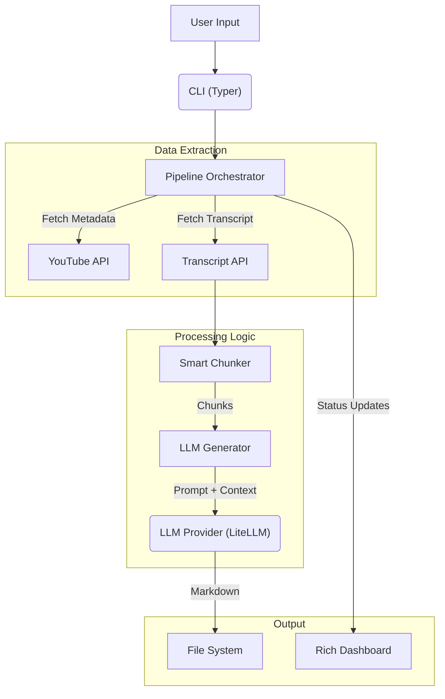

# 🧪 Architecture

`yt-study` is engineered for reliability, concurrency, and modularity. It transforms chaotic YouTube transcripts into structured, academic-quality study notes using a sophisticated multi-stage pipeline.

## 🔄 High-Level Data Flow

## 🧩 Core Components

### 1. Pipeline Orchestrator (`pipeline/orchestrator.py`)

The heart of the application. It manages the lifecycle of multiple video processing tasks concurrently.

- **Concurrency Control**: Uses `asyncio.Semaphore` to manage a pool of worker tasks, preventing system overload and rate-limiting.
- **Dynamic UI**: Initializes the **Rich Dashboard** with the exact number of needed workers, providing real-time feedback on every stage of the process.

### 2. Smart Chunker & Chapter Engine (`llm/generator.py`, `llm/chapters.py`)

Handles the challenge of processing long transcripts within LLM context limits.

1.  **Chapter Identification**: Prioritizes native YouTube chapters. If unavailable, it invokes the **SyntheticChapterEngine** (AI-powered) to identify logical topical shifts.
2.  **Chapter-Aware Chunking**: Splits transcripts while respecting chapter boundaries to maintain topical coherence.
3.  **Recursive Chunking**: If a segment exceeds the `CHUNK_SIZE`, it uses a fallback strategy:
    - Split by **Sentence boundaries** (`. `).
    - Split by **Newlines**.
    - Split by **Spaces**.
    - Hard split (last resort).

### 3. LLM Provider (`llm/providers.py`)

A unified interface for LLMs powered by [LiteLLM](https://docs.litellm.ai/).

- **Multi-Provider**: Supports Google, OpenAI, Anthropic, Groq, and more.
- **Resilience**: Implements retry logic with exponential backoff for handling transient API errors and rate limits.
- **Output Sanitization**: Cleans LLM responses by stripping markdown fences and trailing whitespace.

### 4. YouTube Parsers (`youtube/`)

- **`transcript.py`**: A robust fetcher that traverses a priority list: Manual Captions → Auto-generated → Translated.
- **`metadata.py`**: Extracts video title, author, duration, and chapter information.
- **`parser.py`**: Regex-based validation for various YouTube URL formats (Videos, Shorts, Playlists).

## 🛠️ Tech Stack

- **CLI Framework**: [Typer](https://typer.tiangolo.com/)
- **TUI/Formatting**: [Rich](https://github.com/Textualize/rich)
- **LLM Interface**: [LiteLLM](https://docs.litellm.ai/)
- **YouTube Data**: [pytubefix](https://github.com/JuanBindez/pytubefix) & [youtube-transcript-api](https://github.com/jdepoix/youtube-transcript-api)
- **Web Dashboard**: [Flask](https://flask.palletsprojects.com/) (for `yt-study serve`)
