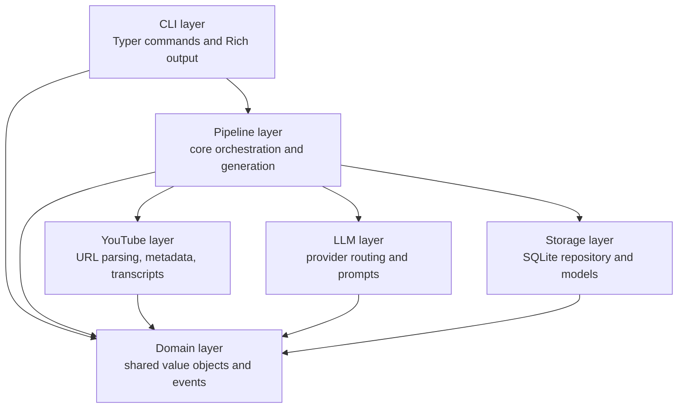

notewise is a Python CLI application built with a clean, layered architecture. Each layer has a single responsibility and strict import boundaries, making the codebase easy to reason about, test, and extend.

---

### Layer overview

---

### Layer responsibilities

<AccordionGroup>
  <Accordion title="CLI Layer">

    The only entry point for human users. Uses [Typer](https://typer.tiangolo.com/) for argument parsing and [Rich](https://github.com/Textualize/rich) for terminal output. Heavy dependencies are loaded lazily inside each command body to keep startup time low.

    | File | Role |
    | --- | --- |
    | `cli/app.py` | Command definitions |
    | `cli/_batch_runner.py` | Multi-video orchestration, feeds events to `PipelineDashboard` |
    | `cli/_single_runner.py` | Single-video run path |
    | `cli/_runtime.py` | `CliProcessRunner` top-level coordinator |
    | `cli/_display.py` | Rich table and panel helpers |
    | `cli/_admin.py` | info / stats / history / cache / logs implementations |

    <Note>
      **Import rule:** The CLI layer may import from all other layers. It must **not** contain business logic — it delegates entirely to the pipeline.
    </Note>
  </Accordion>

  <Accordion title="Pipeline Layer">
    Owns the core processing workflow. The only layer that coordinates between YouTube extraction, LLM generation, and storage.

    | File | Role |
    | --- | --- |
    | `pipeline/core.py` | `CorePipeline`: state, semaphores, DB singleton, public `run()` |
    | `pipeline/_execution.py` | `process_single_video` and `run_pipeline` implementations |
    | `pipeline/generation.py` | `StudyMaterialGenerator`: token counting, chunking, LLM calls |

    <Note>
      **Import rule:** May import from YouTube, LLM, storage, and domain layers. Must **not** import from the CLI layer.
    </Note>
  </Accordion>

  <Accordion title="YouTube Layer">
    Handles all YouTube-specific I/O: transcript fetching, metadata retrieval, playlist enumeration, and URL parsing.

    | File | Role |
    | --- | --- |
    | `youtube/parser.py` | URL and bare-ID parsing → `ParsedURL` |
    | `youtube/transcript.py` | `fetch_transcript()` with language fallback and retries |
    | `youtube/metadata.py` | `get_video_metadata()`, `get_playlist_info()`, `get_source_metadata()` |
    | `youtube/playlist.py` | `extract_playlist_videos()` |
    | `youtube/extractor/` | Low-level HTTP client built from mixins |

    <Note>
      **Import rule:** Must **not** import from the LLM or pipeline layers.
    </Note>
  </Accordion>

  <Accordion title="LLM Layer">
    Provider-agnostic interface over [LiteLLM](https://github.com/BerriAI/litellm).

    | File | Role |
    | --- | --- |
    | `llm/provider.py` | `LLMProvider`, `UsageTotals`, `get_provider()` factory |
    | `llm/prompts/study_notes.py` | Study note generation prompts |
    | `llm/prompts/chapter_notes.py` | Per-chapter generation prompts |
    | `llm/prompts/quiz.py` | Quiz generation prompts |

    <Note>
      **Import rule:** Must **not** import from the YouTube, pipeline, or CLI layers.
    </Note>
  </Accordion>

  <Accordion title="Storage Layer">
    Thread-safe SQLite persistence built on [SQLAlchemy](https://www.sqlalchemy.org/) 2.0.

    | File | Role |
    | --- | --- |
    | `storage/repository.py` | `DatabaseRepository`: singleton per path, sync/async read/write |
    | `storage/models.py` | ORM models: `VideoRecord`, `TranscriptRecord`, `RunStatsRecord`, `ExportRecord` |
    | `storage/schemas.py` | Pydantic schemas for reading data out of the DB |
    | `storage/migrations.py` | Hand-rolled migration runner (no Alembic) |

    <Note>
      **Import rule:** Must **not** import from YouTube, LLM, pipeline, or CLI layers.
    </Note>
  </Accordion>

  <Accordion title="Domain Layer">

    Pure Python value objects — no I/O of any kind. Safe to import from everywhere.

    | File | Role |
    | --- | --- |
    | `domain/youtube.py` | `VideoMetadata`, `VideoTranscript`, `TranscriptSegment`, `VideoChapter`, `ParsedURL` |
    | `domain/events.py` | `EventType` enum, `PipelineEvent` dataclass |
    | `domain/results.py` | `PipelineResult`, `PipelineMetrics` |
  </Accordion>
</AccordionGroup>

---

### Cross-Cutting Concerns

| Concern | Description |
| --- | --- |
| **Configuration** | `config.py` exports a module-level `settings` object. Loaded once on first access and cached. |
| **Error Handling** | All custom exceptions in `errors.py`. See [Error Reference](/docs/reference/pipeline-and-errors/errors). |
| **Logging** | `logging.py` configures structlog at CLI startup. API keys are automatically redacted. |
| **State Directory** | Override with `NOTEWISE_HOME` environment variable. Default: `~/.notewise/` |

---

### State Directory Structure

<Tree>
  <Tree.Folder name=".notewise" defaultOpen>
    <Tree.File name="config.env" />
    <Tree.File name=".notewise_cache.db" />
    <Tree.Folder name="logs" defaultOpen>
      <Tree.File name="notewise-20260101-120000.log" />
      <Tree.File name="notewise-20260102-080000.log" />
    </Tree.Folder>
  </Tree.Folder>
</Tree>
