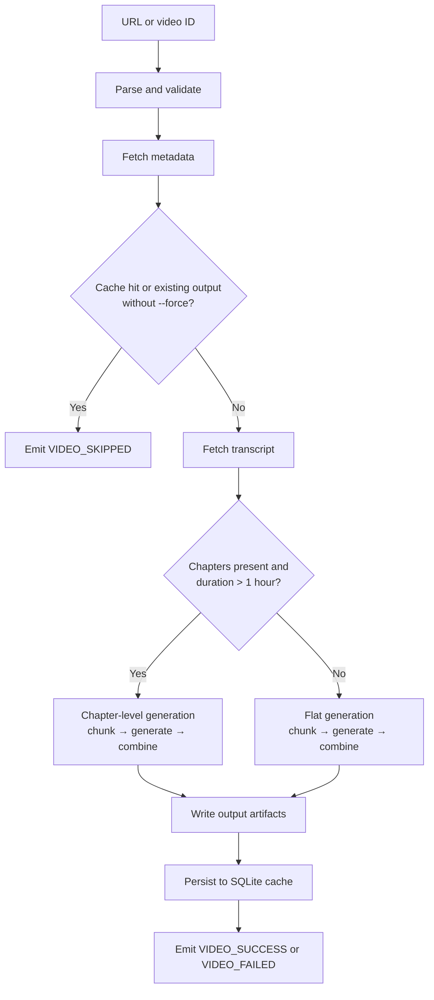

Every video notewise processes goes through the same sequence. Understanding the pipeline helps you predict output behavior, tune concurrency, and debug problems.

---

### Pipeline flowchart

---

### Step details

<AccordionGroup>
  <Accordion title="1. Parse & Validate URL">

    **Purpose:** Extract and normalize the input (URL, ID, or batch file) into a structured `ParsedURL` object.

    **Accepted formats:**
    - Full YouTube watch URL (`https://youtube.com/watch?v=...`)
    - Short URL (`https://youtu.be/...`)
    - Embed URL or Shorts URL
    - Bare 11-character video ID
    - Bare playlist ID (`PL`, `UU`, `LL`, `FL`, `RD`, `UL`, `WL`, `OLAK5uy_`)
    - Playlist URL (`?list=...`)
    - Path to a `.txt` batch file (one URL per line)

    **Returns:** `ParsedURL` with **url_type** (`"video"` or `"playlist"`), **video_id**, and/or **playlist_id**.

    <Info>Module: `youtube/parser.py` → `parse_youtube_url()`</Info>
  </Accordion>

  <Accordion title="2. Fetch Video Metadata">
    **Module:** `youtube/metadata.py` → `get_video_metadata()`

    **Retrieves:** Title, duration (seconds), and chapter list.

    **Early-exit checks:**
    - **Cache hit** — if video ID is in SQLite cache and `--force` is not set → emit `VIDEO_SKIPPED`
    - **Output path check** — if notes already exist in output directory and `--force` is not set → skip
  </Accordion>

  <Accordion title="3. Fetch Transcript">
    **Module:** `youtube/transcript.py` → `fetch_transcript()`

    **Language preference:** Tries languages in order (default: `["en"]`), falling back if unavailable. Uses cookie file if configured.

    **Retries:** Up to 3 attempts with backoff on network errors.

    **Returns:** `VideoTranscript` with list of `TranscriptSegment` (text, start time, duration).
  </Accordion>

  <Accordion title="4. Chunk & Generate">
    **Module:** `pipeline/generation.py` → `StudyMaterialGenerator`

    Token counting uses LiteLLM's `token_counter`. If transcript exceeds **4,000 tokens**, it's split into overlapping 200-token chunks.

    <Accordion title="Chapter-level generation">
      Activated when video has chapters **and** duration exceeds 3,600 seconds (1 hour).

      - Chapters processed concurrently (up to 3 at a time)
      - Each chapter independently chunked and reduced to Markdown
    </Accordion>

    <Accordion title="Flat generation">
      Used for short videos or videos without chapter data.

      - Single-pass for small transcripts
      - Multi-chunk with combine step for large ones
    </Accordion>
  </Accordion>

  <Accordion title="5. Write Outputs">
    **Module:** `pipeline/_artifacts.py`

    | Condition | Output |
    | --- | --- |
    | Standard video | `<OUTPUT_DIR>/<sanitized title>.md` |
    | Chapter-aware video | `<OUTPUT_DIR>/<title>/01_<chapter>.md`, `02_<chapter>.md`, … |
    | `--quiz` | `<title>_quiz.md` alongside notes |
    | `--export-transcript txt` | `<title>_transcript.txt` |
    | `--export-transcript json` | `<title>_transcript.json` |
  </Accordion>

  <Accordion title="6. Persist to Cache">
    **Module:** `storage/repository.py` → `DatabaseRepository.aupsert_video_cache()`

    **Fields written:**
    - Video metadata (id, title, duration)
    - Raw transcript text and language
    - Token usage (prompt, completion, total)
    - Cost estimate (USD)
    - Timing (transcript fetch, generation seconds)
    - Model name

    Powers skip-if-already-processed logic and `stats` / `history` commands.
  </Accordion>

  <Accordion title="7. Events & Result">
    `PipelineEvent` objects emitted via `on_event` callback throughout. CLI subscribes via `PipelineDashboard` for live UI updates.

    **PipelineResult** returns: `success_count`, `failure_count`, `total_count`, `errors`, and `metrics`.

    See [Pipeline Events](/reference/pipeline-and-errors/pipeline-events) for full event reference.
  </Accordion>
</AccordionGroup>

---

### Concurrency Model

notewise uses `asyncio` throughout.

| Level | Default | Config |
| --- | --- | --- |
| Video-level | 5 concurrent videos | `MAX_CONCURRENT_VIDEOS` |
| Chapter-level | 3 concurrent chapters | Code default only |
| YouTube requests | 10/minute | `YOUTUBE_REQUESTS_PER_MINUTE` |

In batch runs, videos are processed concurrently up to `MAX_CONCURRENT_VIDEOS`. Within a single long video with chapters, chapters are processed concurrently up to `DEFAULT_MAX_CONCURRENT_CHAPTERS`.

A `PipelineSharedState` object is passed into `CorePipeline` during batch runs so all video instances share the same semaphores.
