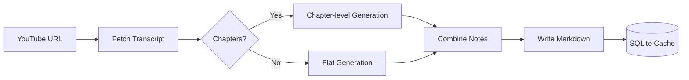

**It** is a command-line tool that turns YouTube content into comprehensive Markdown study notes — powered by the LLM of your choice, with no browser required.

<Tip>
  Built for learners and builders who want repeatable, automatable study workflows from long-form video content.
</Tip>

---

### Quick start

<CardGroup cols={{ base: 1, sm: 2, md: 2 }}>
  <Card title="Quick Start" icon="rocket" href="/docs/getting-started/quickstart">
    Get your first AI-powered study notes in under 5 minutes.
  </Card>
  <Card title="Installation" icon="download" href="/docs/getting-started/installation">
    Install via pip, uv, or Docker.
  </Card>
  <Card title="CLI Reference" icon="terminal" href="/cli/commands/overview">
    Every command, option, and flag documented.
  </Card>
  <Card title="Configuration" icon="settings" href="/docs/getting-started/configuration">
    All settings, defaults, and override mechanisms.
  </Card>
</CardGroup>

---

### Choose your workflow

<Tabs>
  <Tab title="Single video">
    ```bash
    notewise process "https://youtube.com/watch?v=VIDEO_ID"
    ```
    Best for focused notes from one lecture or tutorial.
  </Tab>
  <Tab title="Playlist">
    ```bash
    notewise process "https://youtube.com/playlist?list=PLAYLIST_ID"
    ```
    Best for full course conversion with concurrent processing.
  </Tab>
  <Tab title="Batch file">
    ```bash
    notewise process my-urls.txt -o ./course-notes
    ```
    Best for scripted workflows and repeatable pipelines.
  </Tab>
  <Tab title="Docker">
    ```bash
    docker run --rm \
      -e GEMINI_API_KEY="your_key" \
      -v "$(pwd)/output:/output" \
      ghcr.io/whoisjayd/notewise:latest \
      process "URL" --no-ui
    ```
    Best for CI or containerized environments.
  </Tab>
</Tabs>

---

### How it works



<Steps>
  <Step title="Fetch the transcript">
    Retrieves the video transcript with automatic language fallback and retries. Supports private and age-gated videos via cookie file.
  </Step>
  <Step title="Detect chapters">
    Long videos (over 1 hour with chapter metadata) are split into chapters and processed concurrently for better quality.
  </Step>
  <Step title="Generate notes">
    The transcript is chunked intelligently and sent through your configured LLM via LiteLLM. Supports Gemini, OpenAI, Anthropic, Groq, and more.
  </Step>
  <Step title="Write structured Markdown">
    Study notes are written as Markdown files named from the video title. Optionally generates quizzes and transcript exports.
  </Step>
  <Step title="Cache locally">
    Transcripts and run stats are stored in a local SQLite database. Already-processed videos are skipped on re-runs automatically.
  </Step>
</Steps>

---

### Key features

<CardGroup cols={{ base: 1, sm: 2, lg: 3 }}>
  <Card title="Multi-provider LLM" icon="brain">
    Gemini, OpenAI, Anthropic, Groq, Mistral, Cohere, DeepSeek, and xAI — all via LiteLLM. Switch models with a single flag.
  </Card>
  <Card title="Concurrent processing" icon="zap">
    Multiple videos and chapters processed in parallel. Configurable concurrency keeps you within API and YouTube rate limits.
  </Card>
  <Card title="Local SQLite cache" icon="database">
    Transcripts and run stats persist across runs. Re-run a batch safely — only unprocessed videos are touched.
  </Card>
  <Card title="Rich terminal UI" icon="monitor">
    Live progress dashboard. Use `--no-ui` for CI, cron, or log aggregators.
  </Card>
  <Card title="Playlist & batch support" icon="list">
    Process entire playlists or a `.txt` file of URLs. Re-runs skip already-processed videos unless `--force` is used.
  </Card>
  <Card title="Docker-ready" icon="box">
    Two-stage image published to GHCR on every release. Runs as a non-root user.
  </Card>
</CardGroup>

<Tip>
  The default model is **Gemini 2.5 Flash** — free tier available via [Google AI Studio](https://aistudio.google.com/app/apikey). No billing required to get started.
</Tip>

---

### Example session

<CodeGroup>
```bash terminal
$ notewise process "https://youtube.com/watch?v=dQw4w9WgXcQ"

 notewise  v1.2.1

Processing 1 video...

 Video Title
   ✔ Metadata fetched
   ✔ Transcript fetched  (en, 342 segments)
   ✔ Notes generated  (3 chunks)
   ✔ Written → output/Video Title.md

────────────────────────────────────────
  1 processed · 0 failed · 12.4s · $0.0004
```
</CodeGroup>

---

### Explore by role

<CardGroup cols={{ base: 1, sm: 2 }}>
  <Card title="New user" icon="user" href="/docs/getting-started/quickstart">
    Start with Quick Start → Installation → Configuration.
  </Card>
  <Card title="Power user" icon="zap" href="/cli/commands/process">
    Jump straight to the `process` command reference.
  </Card>
  <Card title="DevOps / CI" icon="server" href="/docs/guides/docker">
    Docker and `--no-ui` patterns for automation.
  </Card>
  <Card title="Contributor" icon="git-pull-request" href="/development/local-setup/setup">
    Dev setup, testing, and CI/CD docs.
  </Card>
</CardGroup>
