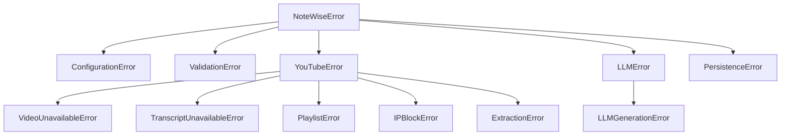

All custom exceptions are defined in `src/notewise/errors.py` and rooted at `NoteWiseError`.

---

### Exception Hierarchy



---

### Exception Details

| Exception | Cause | Resolution |
| --- | --- | --- |
| **ConfigurationError** | Required auth/config for selected model not set | Run `notewise config`, `notewise setup --force`, or `notewise auth login <provider>` for OAuth models |
| **ValidationError** | Malformed URL or invalid option | Check URL format and try again |
| **VideoUnavailableError** | Video is private, age-restricted, or removed | Use `--cookie-file` or verify video is public |
| **TranscriptUnavailableError** | No transcript available in requested language | Run `notewise info "URL"` to check available languages |
| **PlaylistError** | Playlist unavailable or invalid ID | Verify playlist is public and ID is correct |
| **IPBlockError** | YouTube blocked the request | Reduce `YOUTUBE_REQUESTS_PER_MINUTE` and retry |
| **ExtractionError** | General YouTube extraction failure | Run `notewise logs --tail 50` for details |
| **LLMGenerationError** | LLM API call failed after retries | Verify provider auth, model access, and quota with `notewise config` |
| **PersistenceError** | SQLite read/write failure | Run `notewise doctor`, or clear cache with `notewise cache --clear --yes` |

---

### Quick Triage

| Symptom | Start Here |
| --- | --- |
| Auth / private access failures | `VideoUnavailableError` — use `--cookie-file` |
| No captions available | `TranscriptUnavailableError` — try `--language en` |
| LLM call failures | `LLMGenerationError` — check API key and quota |
| Unexpected error | Run `notewise logs --tail 100` for full details |

See [Private Videos](/docs/guides/private-videos) for cookie file instructions.

---

### CLI Error Handling

The `process` command maps exceptions to user-visible failure panels. Exit code is `1` when any video fails.

```bash
notewise logs --tail 100   # full error detail
```

---

### Exception details

<AccordionGroup>
  <Accordion title="NoteWiseError">
    Base class for all NoteWise exceptions. Accepts a message and optional keyword context arguments appended to `str(error)`.

    ```python
    raise NoteWiseError("something went wrong", video_id="abc123")
    # "something went wrong [video_id='abc123']"
    ```
  </Accordion>

  <Accordion title="ConfigurationError">
    Raised when the application configuration is invalid or required settings are missing.

    **Cause:** Required auth/config for the selected model is not set.

    **Resolution:**
    ```bash
    notewise config          # see current resolved settings
    notewise setup --force   # re-run the wizard
    notewise auth login chatgpt
    notewise auth login github_copilot
    ```
  </Accordion>

  <Accordion title="ValidationError">
    Raised for invalid user input — malformed YouTube URLs, bad option values, or missing required arguments.

    **Resolution:** Check the URL or option value and try again.
  </Accordion>

  <Accordion title="UserVisibleCliError">
    A structured CLI failure rendered as a Rich panel without a traceback. Contains:
    - `title` — the panel heading
    - `rows` — list of `(label, value)` tuples
    - `intro` — optional introductory text
  </Accordion>

  <Accordion title="YouTubeError - VideoUnavailableError">
    Raised when a video requires sign-in, is private, age-restricted, or has been removed.

    **Resolution:** Supply a `--cookie-file` for sign-in-required content, or verify the video is publicly accessible. See [Private Videos](/docs/guides/private-videos).
  </Accordion>

  <Accordion title="YouTubeError - TranscriptUnavailableError">
    Raised when no transcript is available in any of the requested languages.

    **Resolution:**
    ```bash
    notewise info "URL"                  # see available transcript languages
    notewise process "URL" --language en
    ```
    If captions are disabled by the creator, use a different video.
  </Accordion>

  <Accordion title="YouTubeError - PlaylistError">
    Raised when a playlist cannot be fetched or enumerated (private playlist, invalid ID).

    **Resolution:** Verify the playlist is public and the ID is correct. For private playlists, supply a `--cookie-file`.
  </Accordion>

  <Accordion title="YouTubeError - IPBlockError">
    Raised when YouTube detects unusual traffic and blocks the request.

    **Resolution:** Reduce `YOUTUBE_REQUESTS_PER_MINUTE` in your config and retry later.
  </Accordion>

  <Accordion title="YouTubeError - ExtractionError">
    General YouTube extraction failure not covered by the more specific subclasses.

    **Resolution:**
    ```bash
    notewise logs --tail 50   # inspect the session log for detail
    ```
  </Accordion>

  <Accordion title="LLMGenerationError">
    Raised when the LLM API call fails after all retries are exhausted (`LLM_NUM_RETRIES` = 3). Includes a redacted summary of the underlying API error.

    **Resolution:**
    ```bash
    notewise config   # verify the API key is set and correct
    ```
    Check your API key validity, OAuth login state, model access, and quota with the provider.
  </Accordion>

  <Accordion title="PersistenceError">
    Raised when SQLite read/write operations fail.

    **Resolution:** Run `notewise doctor` to check cache database health. If corrupted, clear with `notewise cache --clear --yes`.
  </Accordion>
</AccordionGroup>

---

### Quick triage by symptom

<CardGroup cols={{ base: 1, sm: 2 }}>
  <Card title="Auth / private access failures">
    Start with `VideoUnavailableError` and `PlaylistError`. For signed-in resources, provide `--cookie-file` and retry. See [Private Videos](/docs/guides/private-videos).
  </Card>
  <Card title="No captions or language mismatch">
    Start with `TranscriptUnavailableError`:

    ```bash
    notewise info "URL"
    notewise process "URL" --language en
    ```
  </Card>
  <Card title="LLM call failures">
    Check `LLMGenerationError`: validate API key or OAuth login state, quota, and model access for the configured provider with `notewise config`.
  </Card>
  <Card title="Unexpected failure">
    ```bash
    notewise logs --tail 100
    ```
    The session log includes the full exception with context.
  </Card>
</CardGroup>

---

### CLI error handling

The `process` command maps exceptions to user-visible failure panels. Unhandled exceptions are logged to the session log file and a truncated error panel pointing to the log is shown. Exit code is `1` when any video fails.

```bash
notewise logs --tail 100   # full error detail
```
